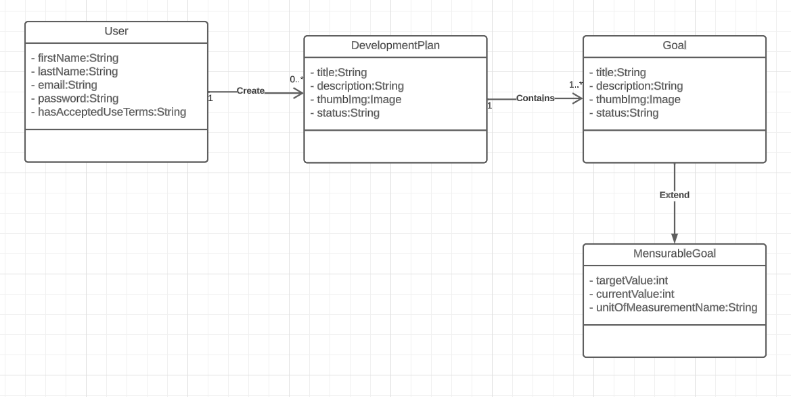

# Indevo

It is an app where the user can manage his PDI by creation plans, goals, and even track the progress of his goals and plans.

## Functional Requirements

- User can create an account;
- User can confirm his email after account creation;
- User can recover his password in function of his email;
- User can authenticate;
- User can create a development plan;
- User can create goals for a plan;
- User can delete a goal from a plan when is creating or editing;
- User can archive a development plan;
- User can delete a development plan.

## System Requirements

- The system must show to the user the progress of the plan in percentage with a progress bar based on the number of accomplished goals in that plan;
- The system must have a landing page with a CTA to send the user to the dynamic application;
- The system must show the user when a goal is done based on the currentValue and targetValue.

## My goals with this project

- Do the static landing page with Next.js;
- Do the dynamic app with Angular.js;
- Study microfrontends and apply if is possible;
- Do the backend api with Spring;
- Do a mobile app with Flutter or React Native.

## Class Diagram

## Use Case Diagrams

### Authentication

### Development plan

